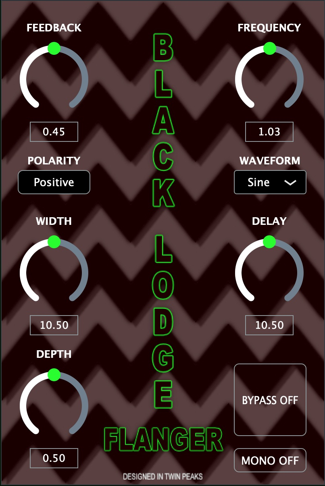

# **JUCE PLUGIN: FLANGER**

## **Overview**

This project is a flanger effect plugin using the JUCE platform. The flanger is implemented using a delay line connected to an LFO and an interpolation algorithm. The effect plugin has various tone-shaping controls such as feedback, LFO frequency, width, delay time and depth. It also has controls for the LFO waveform type and can function in either mono or stereo. This plugin can be used as a VST within any DAW to modify and add effects to the sound of an instrument or a recording. 

## **Flanger Features**
- 

## **Project report with detailed discussion**
[Project Report](https://drive.google.com/file/d/1J9TlQNdbdZR_r4KVOHtxboWwi5eNyTsY/view?usp=sharing)
 
